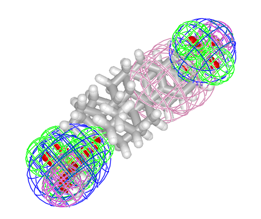
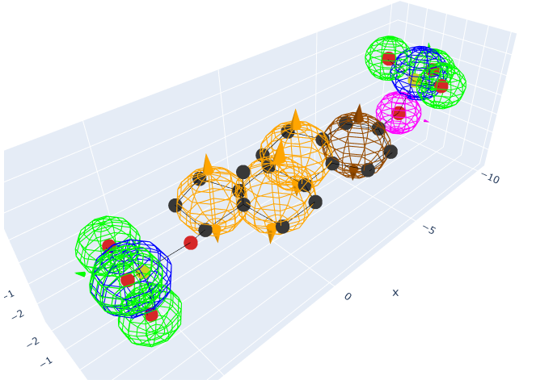

# MolecularGaussians.jl

Alignment and comparison of small molecules read from .sdf files represented as Gaussian Mixture Models. 

## Build GMMs from molecules

```julia
julia> using MolecularGaussians, MolecularGraph; const MG = MolecularGaussians;

julia> # Load molecules from .sdf

julia> mol1 = sdftomol(joinpath(dirname(pathof(MolecularGaussians)), "..", "assets", "data", "E1050_3d.sdf"));

julia> mol2 = sdftomol(joinpath(dirname(pathof(MolecularGaussians)), "..", "assets", "data", "E1103_3d.sdf"));

julia> # Load SMARTS feature definitions, identify specified types of features, and generate pharmacophore models

julia> familydefs = MG.parse_feature_definitions();

julia> featuremaps1 = MG.feature_maps(mol1, familydefs, [:Donor,:Acceptor,:Aromatic,:NegIonizable])
Dict{Symbol, Vector{Vector{Int64}}} with 4 entries:
  :Acceptor     => [[10], [7], [3], [8], [4], [9], [6], [5]]
  :NegIonizable => [[7, 2, 10, 9, 8], [5, 4, 6, 3, 1]]
  :Donor        => [[8], [4]]
  :Aromatic     => [[22, 25, 27, 26, 24, 28]]

julia> featuremaps2 = MG.feature_maps(mol2, familydefs, [:Donor,:Acceptor,:Aromatic,:NegIonizable])
Dict{Symbol, Vector{Vector{Int64}}} with 4 entries:
  :Acceptor     => [[2], [3], [4], [6], [5]]
  :NegIonizable => [[5, 4, 2, 3, 1]]
  :Donor        => [[3], [6]]
  :Aromatic     => [[22, 21, 20, 18, 24, 23]]

julia> pgmm1 = PharmacophoreGMM(mol1; featuremaps=featuremaps1)
PharmacophoreGMM{3, Float64, Symbol, SDFMolGraph} from molecule with formula C18H24O8S2 with 13 Gaussians in 4 GMMs with labels:
[:Acceptor, :NegIonizable, :Donor, :Aromatic]


julia> pgmm2 = PharmacophoreGMM(mol2; featuremaps=featuremaps2)
PharmacophoreGMM{3, Float64, Symbol, SDFMolGraph} from molecule with formula C18H24O5S with 9 Gaussians in 4 GMMs with labels:
[:Acceptor, :NegIonizable, :Donor, :Aromatic]
```

## Compute overlap, L2 distance, and Tanimoto similarity between two GMMs (prior to alignment)
```julia
julia> overlap(pgmm1, pgmm2)
14.698770009236481

julia> MG.distance(pgmm1, pgmm2)
8.351551148172856

julia> tanimoto(pgmm1, pgmm2)
0.6376817879828839
```

## Find transformation to align GMMs (maximize overlap)
```julia
julia> using GaussianMixtureAlignment; GMA = GaussianMixtureAlignment;

julia> res = gogma_align(pgmm1, pgmm2; nextblockfun=GMA.randomblock, maxsplits=10000);

julia> res.tform.linear
3×3 RotationVec{Float64} with indices SOneTo(3)×SOneTo(3)(0.140065, 0.00604162, -0.0256365):
  0.999654    0.0259722   0.00422883
 -0.0251274   0.989879   -0.139669
 -0.00781354  0.139514    0.990189

julia> res.tform.translation
3-element StaticArraysCore.SVector{3, Float64} with indices SOneTo(3):
 -0.8037716894539993
  0.014624813761085135
 -0.32748952219351324

julia> res.upperbound
-15.60909284545779
```

## Compute overlap, L2 distance, and Tanimoto similarity between two GMMs (following alignment)
```julia
julia> overlap(res.tform(pgmm1), pgmm2)
15.60909284545779

julia> MG.distance(res.tform(pgmm1), pgmm2)
6.530905475730233

julia> tanimoto(res.tform(pgmm1), pgmm2)
0.7050177971567348
```

Compare the above with the cooresponding pre-alignment values. As expected, alignment succeeds in maximizing overlap and similarity between the models while minimizing distance.

## Plot molecules and their Gaussian models
```julia
julia> using GLMakie

julia> # Plot the unaligned pharmacophore features

julia> MG.pharmacophoredisplay(pgmm1, pgmm2)
```


```julia
julia> # Plot the aligned pharmacophore features

julia> MG.pharmacophoredisplay(MG.transform(pgmm1, res.tform), pgmm2)
```

