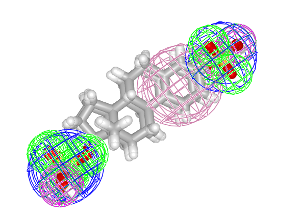

# MolecularGaussians.jl

Alignment and comparison of small molecules read from .sdf files represented as Gaussian Mixture Models. 

## Build GMMs from molecules

```julia
julia> using MolecularGaussians

julia> using MolecularGraph

julia> # note that by default, all standard deviations are set give Gaussians the same volume as the atom the represent, and all weights are set to 1.0

julia>  mol1=sdftomol(joinpath(dirname(pathof(MolecularGaussians)), "..", "data", "E1050_3d.sdf"));       

julia>  mol2=sdftomol(joinpath(dirname(pathof(MolecularGaussians)), "..", "data", "E1103_3d.sdf"));       

julia> molgmm1 = MolGMM(mol1)
MolGMM from molecule with formula C18H24O8S2 with 52 Gaussians.


julia> molgmm2 = MolGMM(mol2)
MolGMM from molecule with formula C18H24O5S with 48 Gaussians.


julia> fmolgmm1 = FeatureMolGMM(mol1)
FeatureMolGMM from molecule with formula C18H24O8S2 with 13 Gaussians in 4 GMMs with labels:
[:acceptor, :rings, :aromaticrings, :anion]


julia> fmolgmm2 = FeatureMolGMM(mol2)
FeatureMolGMM from molecule with formula C18H24O5S with 10 Gaussians in 5 GMMs with labels:
[:acceptor, :rings, :donor, :anion, :aromaticrings]
```

## Compute overlap, L2 distance, and Tanimoto similarity between two GMMs (prior to alignment)
```julia
julia> volume_overlap = overlap(molgmm1, molgmm2)
181.56864709133825

julia> volume_dist = distance(molgmm1, molgmm2)
49.80738859148869

julia> volume_tanimoto = tanimoto(molgmm1, molgmm2)
0.7847340220671545

julia> pharm_overlap = overlap(phgmm1, phgmm2)
11.28943335408716

julia> pharm_distance = distance(phgmm1, phgmm2)
10.337256543228076

julia> pharm_tanimoto = tanimoto(phgmm1, phgmm2)
0.522013928515646
```

## Find transformation to align GMMs (maximize overlap)
```julia
julia> vol_res = tiv_gogma_align(molgmm1, molgmm2, 1, 1; maxstagnant=10000);

julia> vol_res.tform.linear
3×3 AngleAxis{Float64} with indices SOneTo(3)×SOneTo(3)(0.177006, 0.831781, 0.469589, -0.296019):
  0.995185  0.058227   0.0788397
 -0.046021  0.987821  -0.148635
 -0.086534  0.144291   0.985744

julia> vol_res.tform.translation
3-element SVector{3, Float64} with indices SOneTo(3):
 -1.0841450323388633
  0.13044213112141811
  0.2683821716155978

julia> vol_res.upperbound
-200.92689320947045

julia> overlap(vol_res.tform(molgmm1), molgmm2)
200.92689320947045

julia> pharm_res = tiv_gogma_align(phgmm1, phgmm2);

julia> pharm_res.tform.linear
3×3 AngleAxis{Float64} with indices SOneTo(3)×SOneTo(3)(0.189525, 0.804209, 0.541829, -0.244275):
  0.993675   0.0538222   0.0985588
 -0.0382172  0.987351   -0.153877
 -0.105594   0.149137    0.983162

julia> pharm_res.tform.translation
3-element SVector{3, Float64} with indices SOneTo(3):
 -1.108662889088108
  0.10852843341382867
  0.3180677108531508
```

## Compute overlap, L2 distance, and Tanimoto similarity between two GMMs (following alignment)
```julia
julia> volume_overlap = overlap(vol_res.tform(molgmm1), molgmm2)
200.92689320947045

julia> volume_dist = distance(vol_res.tform(molgmm1), molgmm2)
11.090896355224345

julia> volume_tanimoto = tanimoto(vol_res.tform(molgmm1), molgmm2)
0.9476888407430544

julia> pharm_overlap = overlap(pharm_res.tform(phgmm1), phgmm2)
13.413477907601823

julia> pharm_distance = distance(pharm_res.tform(phgmm1), phgmm2)
6.089167436198743

julia> pharm_tanimoto = tanimoto(pharm_res.tform(phgmm1), phgmm2)
0.6877773589758506
```

Compare the above with the cooresponding pre-alignment values. As expected, alignment succeeds in maximizing overlap and similarity between the models while minimizing distance.

## Plot molecules and their Gaussian models
```julia
julia> # Plot the unaligned pharmacophore features

julia> plotdrawing(drawPharmacophoreGMMs([phgmm1,phgmm2]))
```


```julia
julia> # Plot the aligned pharmacophore features

julia> plotdrawing(drawPharmacophoreGMMs([affinetransform(phgmm1, pharm_res.tform),phgmm2]))
```

