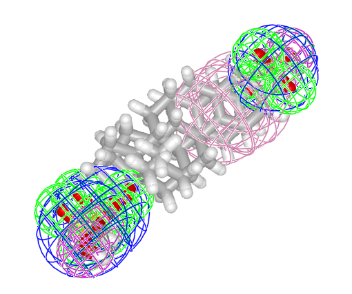
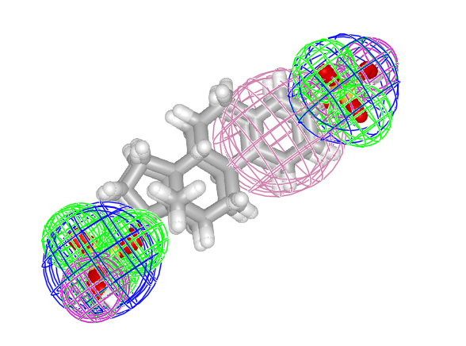

```@meta
CurrentModule = MolecularGaussians
DocTestSetup = quote
    using MolecularGaussians, MolecularGraph
end
```

# MolecularGaussians.jl

MolecularGaussians.jl aligns and compares small molecules by modeling them as
Gaussian mixture models. A molecule read from an `.sdf` file, or a chosen set of
its pharmacophore features, is represented as a mixture of isotropic Gaussians;
[GaussianMixtureAlignment.jl](https://github.com/tmcgrath325/GaussianMixtureAlignment.jl)
then supplies the overlap, distance, and rigid-alignment operations that act on
those mixtures.

See [Concepts](@ref) for the ideas behind the representation, and the
[API reference](@ref) for the full list of exported and public names.

## Installation

MolecularGaussians.jl is registered in the General registry:

```julia
julia> using Pkg; Pkg.add("MolecularGaussians")
```

## Building GMMs from molecules

A [`PharmacophoreGMM`](@ref) holds one labeled `IsotropicGaussian` per feature,
each tagged with its pharmacophore family. The families are chosen by a
[`feature_maps`](@ref) dictionary, which [`parse_feature_definitions`](@ref)
derives from bundled SMARTS definitions.

```jldoctest quickstart
julia> datadir = joinpath(pkgdir(MolecularGaussians), "assets", "data");

julia> mol1 = sdftomol(joinpath(datadir, "E1050_3d.sdf"));

julia> mol2 = sdftomol(joinpath(datadir, "E1103_3d.sdf"));

julia> familydefs = parse_feature_definitions();

julia> families = [:Donor, :Acceptor, :Aromatic, :NegIonizable];

julia> pgmm1 = PharmacophoreGMM(mol1; feature_maps = feature_maps(mol1, familydefs, families))
PharmacophoreGMM{3, Float64, Symbol, SDFMolGraph} from molecule with formula C18H24O8S2 with 13 Gaussians labeled:
[:Acceptor, :NegIonizable, :Donor, :Aromatic]

julia> pgmm2 = PharmacophoreGMM(mol2; feature_maps = feature_maps(mol2, familydefs, families))
PharmacophoreGMM{3, Float64, Symbol, SDFMolGraph} from molecule with formula C18H24O5S with 9 Gaussians labeled:
[:Acceptor, :NegIonizable, :Donor, :Aromatic]
```

## Overlap, distance, and Tanimoto similarity

`overlap`, `distance`, and `tanimoto` compare two mixtures. `distance` is
exported by several loaded packages, so it is qualified here to select the
MolecularGaussians method.

```jldoctest quickstart
julia> round(overlap(pgmm1, pgmm2); digits = 4)
14.6988

julia> round(MolecularGaussians.distance(pgmm1, pgmm2); digits = 4)
8.3516

julia> round(tanimoto(pgmm1, pgmm2); digits = 4)
0.6377
```

## Aligning two GMMs

`gogma_align` searches for the rigid transformation that maximizes overlap. Its
branch-and-bound search is stochastic when `nextblockfun = GMA.randomblock`, so
the exact numbers below vary from run to run and this block is illustrative
rather than doctested.

```julia
julia> using GaussianMixtureAlignment; const GMA = GaussianMixtureAlignment;

julia> res = gogma_align(pgmm1, pgmm2; nextblockfun = GMA.randomblock, maxsplits = 10000);

julia> round(overlap(res.tform(pgmm1), pgmm2); digits = 4)   # higher than before alignment
15.6091

julia> round(tanimoto(res.tform(pgmm1), pgmm2); digits = 4)  # higher than before alignment
0.7050
```

Alignment maximizes overlap and similarity between the models while minimizing
their distance, so the post-alignment overlap and Tanimoto values exceed their
pre-alignment counterparts.

## Plotting molecules and their Gaussian models

`pharmacophoredisplay` plots one or more `PharmacophoreGMM`s together with their
molecules. It is provided by a package extension and requires a Makie backend to
be loaded.

```julia
julia> using GLMakie

julia> MolecularGaussians.pharmacophoredisplay(pgmm1, pgmm2)          # unaligned

julia> MolecularGaussians.pharmacophoredisplay(res.tform(pgmm1), pgmm2)  # aligned
```




